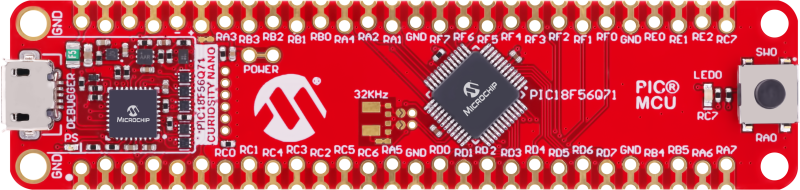
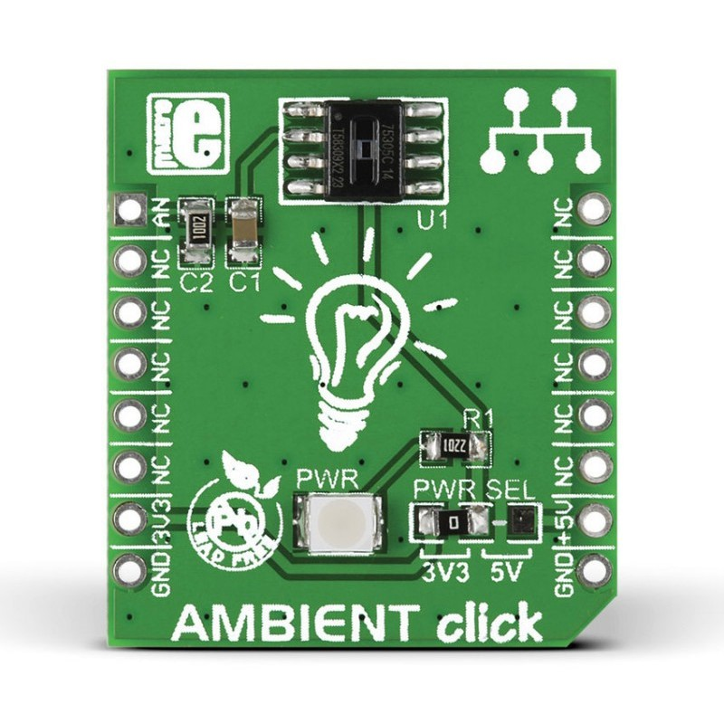
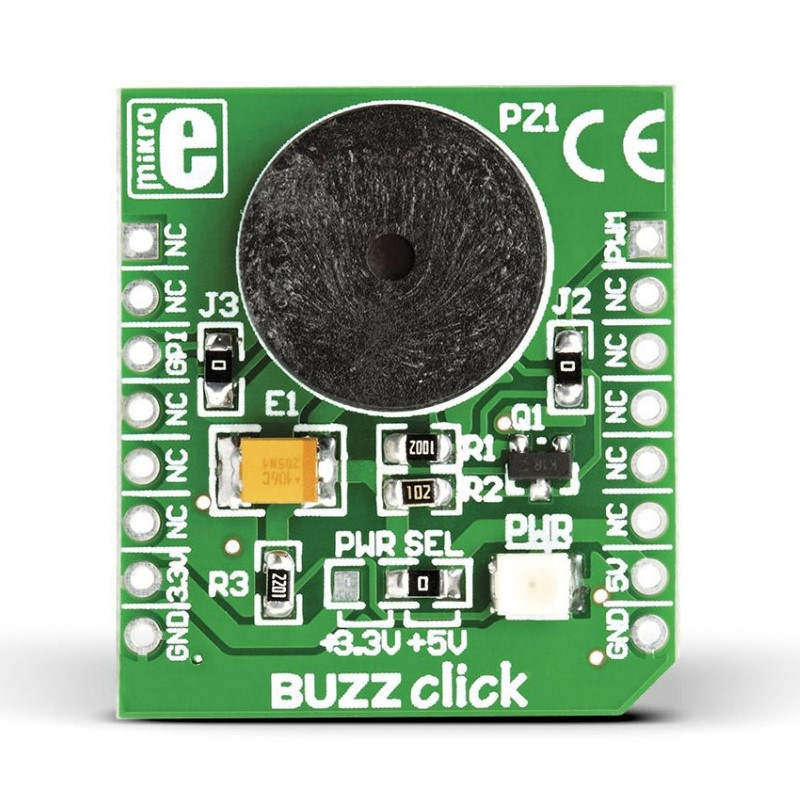
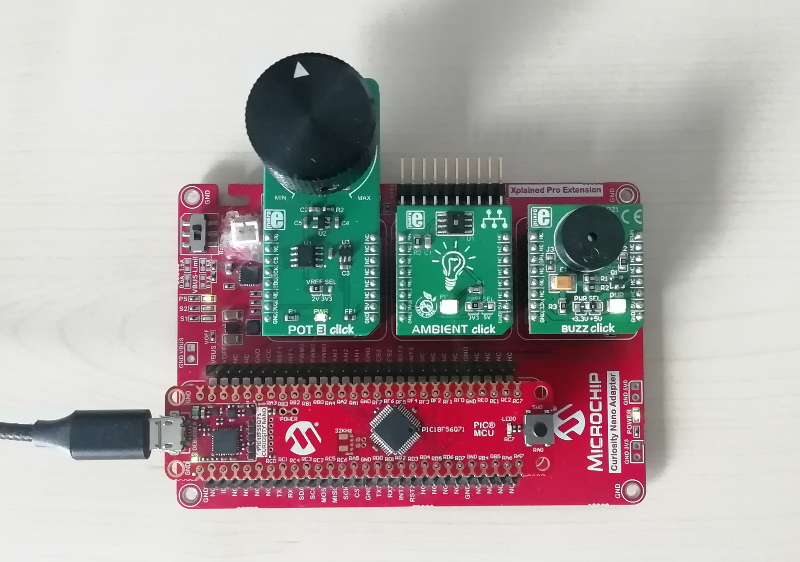
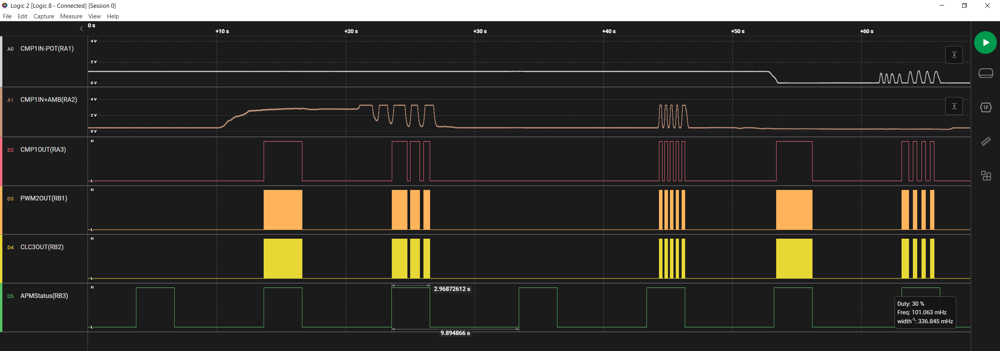
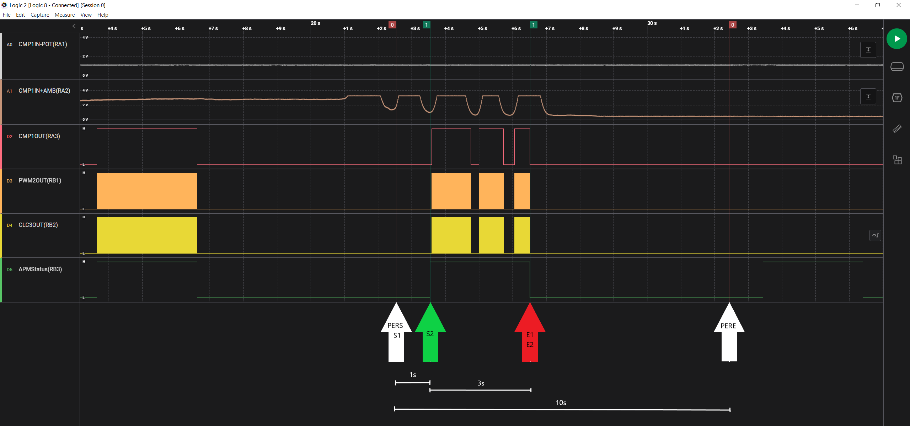

# Analog Peripheral Manager (APM) — Light-sensing alarm with CMP and APM using PIC18F56Q71 Microcontroller with MCC Melody

This code example demonstrates one use case of the Analog Peripheral Manager (APM) and showcases its configuration in MCC Melody. The Comparator peripheral (CMP) and the APM are used to create a ligth-sensing alarm. Two Click boards, a POT 3 potentiometer, and an AMBIENT light sensor supply the Comparator's input signals. The Comparator’s output signal and a PWM signal are inputs to the Configurable Logic Cell (CLC) module set up as an AND gate whose output drives a BUZZ Click board. The potentiometer sets the threshold at which the speaker is driven. The APM will switch the Comparator on and off based on the specified period and event timings.

## Related Documentation

More details and code examples on the PIC18F56Q71 can be found at the following links:

- [PIC18-Q71 Product Family Page](https://www.microchip.com/en-us/products/microcontrollers-and-microprocessors/8-bit-mcus/pic-mcus/pic18-q71)
- [PIC18F56Q71 Code Examples on GitHub](https://github.com/orgs/microchip-pic-avr-examples/repositories?q=pic18f56q71&type=all&language=&sort=)

## Software Used

- [MPLAB® X IDE](http://www.microchip.com/mplab/mplab-x-ide) v6.10 or newer
- [MPLAB® XC8](http://www.microchip.com/mplab/compilers) v2.41 or newer
- [PIC18F-Q Series Device Pack](https://packs.download.microchip.com/) v1.18.389 or newer

## Hardware Used

- The [PIC18F56Q71 Curiosity Nano](https://www.microchip.com/en-us/development-tool/EV01G21A) development board is used as a test platform:
   

- [Curiosity Nano Adapter](https://www.microchip.com/en-us/development-tool/AC164162):
   

- [POT 3 CLICK](https://www.mikroe.com/pot-3-click) board (mikroBUS socket 1):
   

- [AMBIENT CLICK](https://www.mikroe.com/ambient-click) board (mikroBUS socket 2):
   

- [BUZZ CLICK](https://www.mikroe.com/buzz-click) board (mikroBUS socket 3):
   
 

## Operation

To program the Curiosity Nano board with this MPLAB® X project, follow the steps provided in the [How to Program the Curiosity Nano Board](#how-to-program-the-curiosity-nano-board) chapter.  

## Setup

The following configurations must be made for this project:

- Clock Control:
  - Clock Source: HFINTOSC
  - HF Internal Clock: 1 MHz
  - Clock Divider: 1
- Configuration bits:
  - WDT operating mode: WDT Disabled
- Interrupt Manager:
  - Enable Vectored Interrupt: Yes
- CMP1:
  - Enable Comparator: No
  - Mode: asynchronous
  - Hysteresis: 30 mV
  - Positive Input Selection: CIN0+
  - Negative Input Selection: CIN1-
  - Output Polarity: not inverted
  - Comparator Speed: 50 ns high speed
  - Enable Comparator Interrupt: Yes
  - Enable Rising Edge Interrupt: intFlag_pos
  - Enable Falling Edge Interrupt: no_intFlag
- PWM2:
  - Enable PWM: No
  - Clock Source: LFINTOSC
  - Clock Prescaler: 10
  - Mode: Left aligned mode
  - Requested Frequency: 0.5 kHz
  - Output1 Duty Cycle: 50%
  - Period Interrupt Enable: Yes
  - Period Interrupt Postscaler: No postscale
- CLC3:
  - Enable CLC: Yes
  - Logic Cell Mode bits: AND-OR
  - First OR gate input: PWM2_OUT1
  - Second OR gate input: CMP1_OUT   
- APM:
  - Enable APM: Yes
  - Clock Source: LFINTOSC
  - Requested Period: 10s
  - APM Events:
    - Start 1: enable CMP1
    - End 1: disable CMP1
    - Start 2: -
    - End 2: -
  - Requested Start 1: 1s
  - Requested End 1: 3s
  - Requested Start 2: 0s
  - Requested End2: 3s

| Pin | Configuration  |        Description        |
| :-: | :------------: | :-----------------------: |
| RA1 |  Analog input  |        potentiometer      |
| RA2 |  Analog input  |    ambient light sensor   |
| RA3 | Digital output |            CMP1           |
| RB1 | Digital output |            PWM2           |
| RB2 | Digital output |            CLC3           |
| RB3 | Digital output |   analog modules status   |
| RC7 | Digital output |      speaker status       |

| Pin |     Label      |
| :-: | :------------: |
| RB3 |    APMStatus   |
| RC7 |      LED       |

 

## Demo

Board setup:

 

Logic analyzer screen captures:

 
 

## Summary

This code example shows how to configure the APM to toggle the CMP and create a light-sensing alarm. 

  
[Back to Top](#analog-peripheral-manager-apm--light-sensing-alarm-with-cmp-and-apm-using-pic18f56q71-microcontroller-with-mcc-melody)
 

## How to Program the Curiosity Nano Board

This chapter demonstrates how to use the MPLAB X IDE to program a PIC® device with an Example_Project.X. This applies to other projects.

1.  Connect the board to the PC.

2.  Open the Example_Project.X project in MPLAB® X IDE.

3.  Set the Example_Project.X project as main project.
     Right click the project in the **Projects** tab and click **Set as Main Project**.
     

4.  Clean and build the Example_Project.X project.
     Right click the **Example_Project.X** project and select **Clean and Build**.
     

5.  Select **PICxxxxx Curiosity Nano** in the Connected Hardware Tool section of the project settings:
     Right click the project and click **Properties**.
     Click the arrow under the Connected Hardware Tool.
     Select **PICxxxxx Curiosity Nano** (click the **SN**), click **Apply** and then click **OK**:
     

6.  Program the project to the board.
     Right click the project and click **Make and Program Device**.
     

 

- [Back to Setup](#setup)
- [Back to Demo](#demo)
- [Back to Summary](#summary)
- [Back to Top](#analog-peripheral-manager-apm--light-sensing-alarm-with-cmp-and-apm-using-pic18f56q71-microcontroller-with-mcc-melody)
